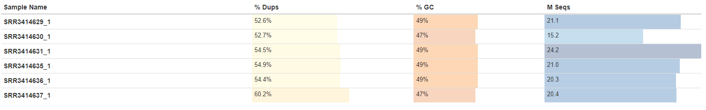
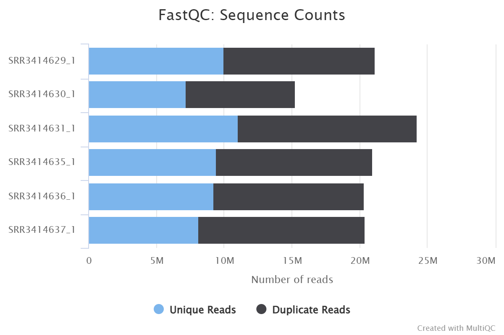
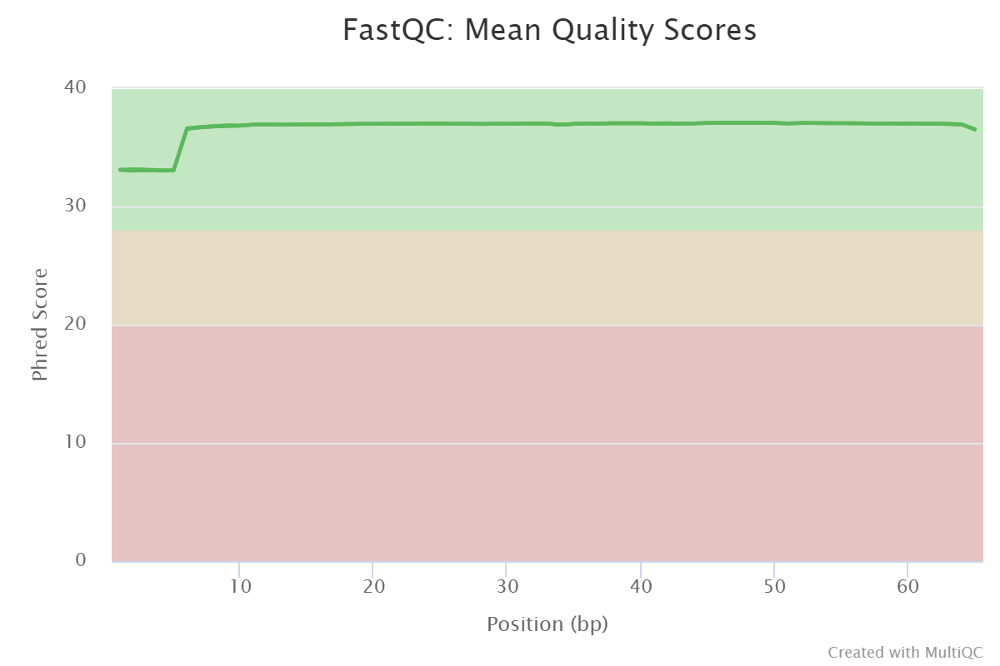
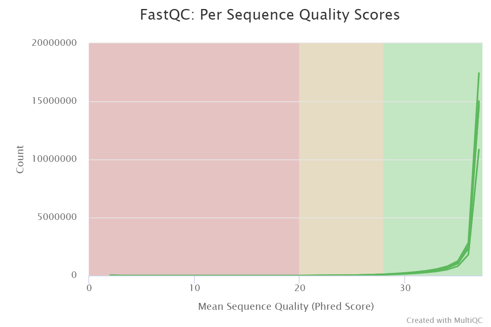
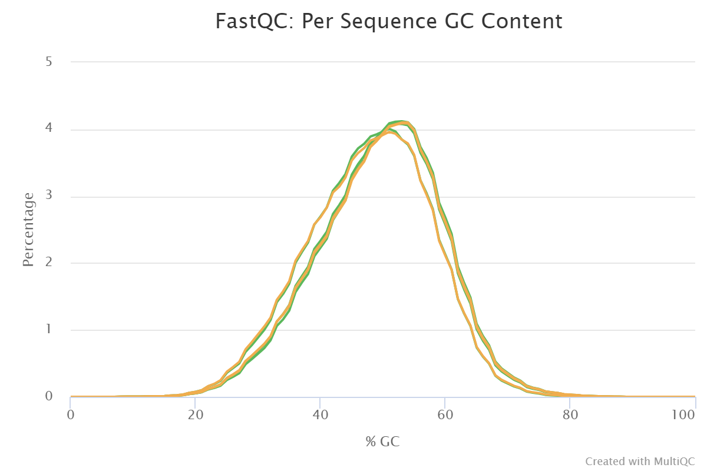
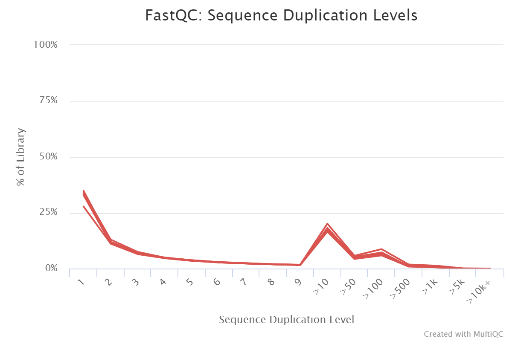
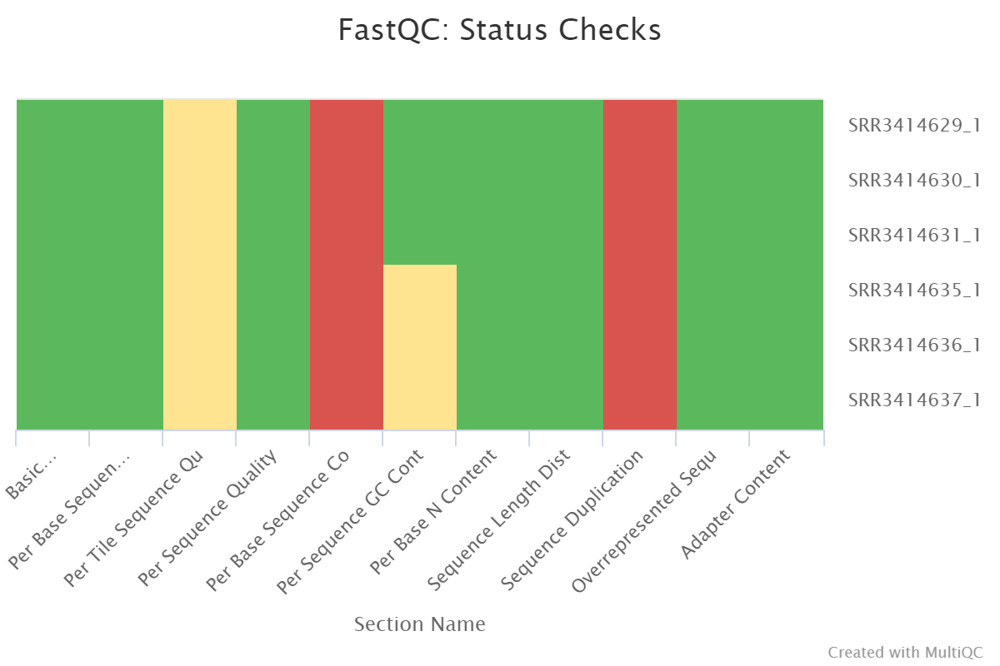

# hse21_hw3
Ссылка на колаб:
```
https://colab.research.google.com/drive/1muDYdb5DWCInB-FlbdEWWF7KTuxE7oYJ?usp=sharing
```
# Выравнивание RNA-seq чтений на геном мыши









# ALL_counts.csv
```
https://github.com/Polindromka/hse21_hw3/blob/main/ALL_counts.csv
```
# HEATMAP

