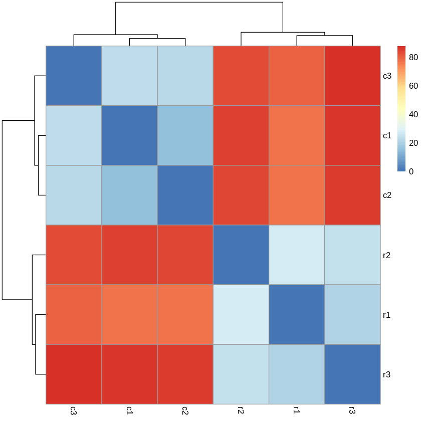

# hse21_hw3

Ссылка на колаб:
https://colab.research.google.com/drive/1muDYdb5DWCInB-FlbdEWWF7KTuxE7oYJ?usp=sharing \
Второй колаб:
https://colab.research.google.com/drive/1ZeNoId7s22iw-mKZdf1qUhQhwAwDh5QN?usp=sharing
# Выравнивание RNA-seq чтений на геном мыши

# ALL_counts
https://github.com/Polindromka/hse21_hw3/blob/main/data/ALL_counts.csv
# TABLE
ID | Тип образца | Общее кол-во исходных чтений | Кол-во и процент чтений, которые были успешно откартированы на геном | Кол-во и процент уникально откартированных чтений | Общее кол-во чтений, которые попали на гены
--- | --- | --- | --- |--- |--- 
SRR3414629 | reprogramming | 21106089 | 20510113 (97.18%) | 18375888 (87.06%) | 16049609
SRR3414630 | reprogramming | 15244711 | 14832680 (97.30%) | 13186139 (86.50%) | 11465324
SRR3414631 | reprogramming | 24244069 | 23547686 (97.13%) | 20928945 (86.33%) | 18408851
SRR3414635 | control | 20956475 | 20395865 (97.32%) | 18428317 (87.94%) | 16275997
SRR3414636 | control | 20307147 | 19757059 (97.29%) | 17825380 (87.78%) | 15757580
SRR3414637 | control | 20385570 | 19847291 (97.36%) | 17844858 (87.54%) | 15736978
# HEATMAP

# Differentially_expressed_genes
https://github.com/Polindromka/hse21_hw3/blob/main/data/differentially_expressed_genes.csv
# MA

# PHEATMAP

# Normalized counts

